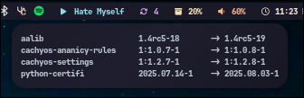

> [!IMPORTANT]  
> This project is in active development. As I'm learning Zig, updates may take time. Your contributions, feedback, and patience are greatly appreciated! 🚀


## zig-waybar-contrib

**High-performance Waybar modules written in Zig for efficient system monitoring**

[](https://gnu.org/licenses/gpl-3.0)
[](https://ziglang.org/)
[](https://github.com/Alexays/Waybar)

### Overview

`zig-waybar-contrib` is a collection of lightweight, blazingly fast Waybar modules built with Zig. These modules are designed to provide accurate system monitoring with minimal resource usage, taking advantage of Zig's performance characteristics and memory safety.

### Why Zig?

- **Zero-cost abstractions** - Runtime performance without sacrificing code clarity
- **Compile-time safety** - Catch errors before they reach production
- **Small binaries** - Minimal overhead for system monitoring
- **Fast compilation** - Quick iteration during development

### Features

- ⚡ **Ultra-fast execution** - Optimized with `ReleaseFast` + LTO + LLVM
- 🔒 **Memory safe** - No buffer overflows or memory leaks
- 🧩 **Modular design** - Include only what you need
- 📊 **Real-time data** - Accurate, up-to-date system metrics
- 🎯 **Waybar native** - JSON output format, seamless integration
- 🪶 **Lightweight** - Minimal system dependencies

### Available Modules

All modules output single-line JSON compatible with Waybar's `custom` module interface.

| Module      | Description                    | Status       | Dependencies                       | Platforms             | Signal   |
|-------------|--------------------------------|--------------|------------------------------------|-----------------------|----------|
| **Updates** | System package update tracker  | ✅ Ready     | `fakeroot`                         | Arch Linux            | 10       |
| **GPU**     | GPU usage, temperature, memory | ✅ Ready     | `rocm-smi-lib`, `amdsmi` or `cuda` | AMD RX Series, NVIDIA | 11       |
| **Memory**  | RAM usage and statistics       | ✅ Ready     | None                               | Linux                 | 12       |
| **Ping**    | Network latency monitoring     | ✅ Ready     | None                               | Linux                 | 13       |

<!--
### Planned Modules

- [ ] **CPU** - Processor usage and frequency monitoring  
- [ ] **Disk** - Storage usage and I/O statistics
- [ ] **Network** - Bandwidth and connection monitoring
- [ ] **Battery** - Power status for laptops
- [ ] **Temperature** - System thermal monitoring
-->

### Screenshots

#### Updates


#### GPU


#### Memory


#### Ping


## Installation

### Quick Installation

#### [From AUR (Recommended)](https://aur.archlinux.org/packages/zig-waybar-contrib)

You can easily install the latest version of **zig-waybar-contrib** from the Arch User Repository (AUR). 
This package provides pre-built binaries as `waybar-module-X-bin`.

Use your preferred AUR helper:

```bash
# Using paru
paru -S zig-waybar-contrib

# Using yay
yay -S zig-waybar-contrib
```

#### From GitHub Releases

Download pre-compiled binaries from the [GitHub Releases page](https://github.com/erffy/zig-waybar-contrib/releases).
Simply extract the downloaded archive and move the binaries to your system’s PATH or use them directly.

### Build from Source

**Requirements:**
- Zig: 0.14.0+
- Git
- rocm-smi-lib, amdsmi or cuda (for gpu module, optional)

```bash
# Clone the repository
git clone https://github.com/erffy/zig-waybar-contrib.git && cd zig-waybar-contrib

# Build all modules
zig build

# Install to system
sudo cp zig-out/bin/* /usr/local/bin/
```

### Configuration

#### Basic Waybar Setup

Add to your Waybar configuration (`~/.config/waybar/config.jsonc`):

```jsonc
{
  // Load default module configurations from zig-waybar-contrib
  "include": [
    "/etc/zig-waybar-contrib/config.jsonc"
  ],

  // Display these modules on the right side of the Waybar
  "modules-right": [
    "custom/updates#zwc",
    "custom/gpu#zwc",
    "custom/memory#zwc",
    "custom/ping#zwc"
  ],

  // 🛠️ Custom modules configuration
  "custom/updates#zwc": {
    "exec": "/usr/bin/waybar-module-updates-bin",
    "return-type": "json",
    "interval": 0,
    "signal": 10,
    "escape": true
  },

  "custom/gpu#zwc": {
    "exec": "/usr/bin/waybar-module-gpu-bin",
    "return-type": "json",
    "interval": 0,
    "signal": 11
  },

  "custom/memory#zwc": {
    "exec": "/usr/bin/waybar-module-memory-bin",
    "return-type": "json",
    "interval": 0,
    "signal": 12
  },

  "custom/ping#zwc": {
    "exec": "/usr/bin/waybar-module-ping-bin",
    "return-type": "json",
    "interval": 0,
    "signal": 13
  }
}
```

<!--

PLANNED FEATURE

### Advanced Configuration

#### Module-specific Settings

Each module accepts environment variables for customization:

```bash
# Ping module settings
export PING_HOST=8.8.8.8   # Target host
export PING_WARN_MS=50     # Warning latency
export PING_CRIT_MS=200    # Critical latency
```
--->

### Development

#### Project Structure

```
zig-waybar-contrib/
│
├── README.md               # Project overview, installation, and usage instructions
├── CHANGELOG.md            # Version history with detailed changes per release
├── LICENSE                 # Project license (GPL-3.0-only)
├── config.waybar.jsonc     # Example Waybar module configuration (JSONC format)
├── .gitignore              # Git exclusions for build artifacts, cache files, etc.
│
├── build.zig               # Zig build script for compiling all modules
├── build.zig.zon           # Zig package and dependency declaration (Zon format)
│
├── tests/                  # Test files
│
├── src/                    # Source code
│   │
│   ├── utils/              # Shared utility modules
│   │   ├── mod.zig         # Module loader and common interfaces
│   │   ├── waybar.zig      # Waybar signal sender (e.g., USR1/USR2 signaling)
│   │   └── format.zig      # Byte/usage formatting helpers (e.g., human-readable memory)
│   │
│   ├── gpu/                # GPU statistics and backend integration
│   │   ├── gpu.zig         # Unified GPU module (auto-selects backend at compile time)
│   │   └── backend/        # Individual backend implementations
│   │       ├── amdsmi.zig      # AMD SMI interface (ROCm 5.x+)
│   │       ├── rocmsmi.zig     # Legacy ROCm SMI interface
│   │       └── nvml.zig        # NVIDIA GPU interface (via NVML/CUDA)
│   │
│   ├── memory.zig          # Module for tracking and displaying memory usage
│   ├── ping.zig            # Module for displaying ping/latency to a target host
│   └── updates.zig         # Module for checking for system/package updates
│
└── assets/                 # Images, screenshots, and other media assets
```

<!--
## Troubleshooting

### Common Issues

**Module not updating:**
```bash
# Check if module runs standalone
/usr/local/bin/gpu-module

# Verify Waybar can execute it
waybar -l debug
```

**Permission errors:**
```bash
# Ensure modules are executable
chmod +x /usr/local/bin/*-module
```

**GPU module shows no data (AMD):**
```bash
# Check GPU files exist
ls /sys/class/drm/card*/device/
```
-->

### Contributing

Contributions are welcome! Here's how you can help:

#### Code Contributions
- 🐛 **Bug Fixes** - Help squash issues
- ⚡ **Performance Improvements** - Make modules even faster  
- 🧩 **New Modules** - Add support for more system metrics
- 🎨 **Code Quality** - Improve readability and maintainability

#### Other Ways to Help
- 📖 **Documentation** - Improve guides and examples
- 🧪 **Testing** - Report bugs and compatibility issues
- 💡 **Feature Requests** - Suggest new modules or improvements
- 🎨 **Themes** - Share your Waybar styling configs

#### Development Workflow

1. Fork the repository
2. Create a feature branch: `git checkout -b feature/amazing-module`
3. Make your changes and test thoroughly
4. Follow Zig style conventions: `zig fmt src/`
5. Add tests if applicable
6. Submit a pull request with a clear description

### Roadmap

- [ ] Implement configuration support

### License

This project is licensed under the **GNU General Public License v3.0**. See [LICENSE](./LICENSE) for details.

### Acknowledgments

- **Zig Team** - For creating an amazing systems programming language
- **Waybar Contributors** - For the excellent status bar that makes this possible  
- **Community** - For feedback, bug reports, and contributions

---

<div align="center">

**Made with ❤️ by Me**

*Star ⭐ this repo if you find it useful!*

</div>
