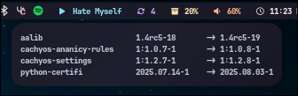
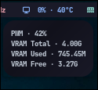
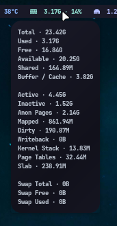
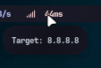

> [!IMPORTANT]
> I'm currently on `(shit)` Windows, and the project won't receive any updates during this time.<br>
> Working with Linux is a bit tedious, so I may switch to Linux<br>
> in 3-4 months or sooner/later, at which point I will continue developing the project.

> [!NOTE]
> This project is in active development. As I'm learning Zig, updates may take time. Your contributions, feedback, and patience are greatly appreciated! 🚀

## zig-waybar-contrib [](https://gnu.org/licenses/gpl-3.0) [](https://ziglang.org/) [](https://github.com/Alexays/Waybar)

**High-performance Waybar modules written in Zig for efficient system monitoring**


### Overview

`zig-waybar-contrib` is a collection of lightweight, blazingly fast Waybar modules built with Zig. These modules are designed to provide accurate system monitoring with minimal resource usage, taking advantage of Zig's performance characteristics and memory safety.

### Why Zig?

- **Zero-Cost Abstractions** - Runtime performance without sacrificing code clarity
- **Compile-Time Safety** - Catch errors before they reach production
- **Small Binaries** - Minimal overhead for system monitoring
- **Fast Compilation** - Quick iteration during development

### Features

- ⚡ **Ultra-Fast Execution** - Optimized with `ReleaseFast` + LTO + LLVM
- 🔒 **Memory Safe** - No buffer overflows or memory leaks
- 📊 **Real-Time Data** - Accurate, up-to-date system metrics
- 🎯 **Waybar Native** - JSON output format, seamless integration
- 🪶 **Lightweight** - Minimal system dependencies

### Available Modules

> All modules output single-line JSON compatible with Waybar’s `custom` module interface.

- **Updates** – Tracks system package updates
  - **Dependencies:** `fakeroot`
  - **Platforms:** Arch Linux
  - **Signal:** 10

- **GPU** – Monitors GPU usage, temperature, memory, and fan/PWM
  - **Dependencies:** `rocm-smi-lib`, `amdsmi`, or `cuda`
  - **Platforms:** Any Linux
  - **Signal:** 11
  - **Notes:** Currently Intel GPUs is not supported

- **Memory** – RAM usage and statistics
  - **Platforms:** Any Linux
  - **Signal:** 12

- **Ping** – Measures network latency
  - **Platforms:** Any Linux
  - **Signal:** 13

### Screenshots
#### Updates

#### GPU

#### Memory

#### Ping


## Installation

### Quick Installation

#### [From AUR (Recommended)](https://aur.archlinux.org/packages/zig-waybar-contrib)

You can easily install the latest version of **zig-waybar-contrib** from the AUR.
This package provides pre-built binaries as `waybar-module-X-bin`.

Use your preferred AUR helper:

```bash
# Using paru
paru -S zig-waybar-contrib

# Using yay
yay -S zig-waybar-contrib
```

#### Build from Source

**Requirements:**

- `zig` (0.15.x) — for building the code
- `git` — for cloning the repository
- `rocm-smi-lib`, `amdsmi` — AMD GPU backend (optional)
- `cuda` — NVIDIA GPU backend (optional)

```bash
# Clone the repository
git clone https://github.com/erffy/zig-waybar-contrib.git
# or clone from AUR
git clone https://aur.archlinux.org/zig-waybar-contrib.git

# cd to source
cd zig-waybar-contrib

# Install to system*
makepkg --si

# Build all modules**
zig build -Drelease

# Install to system**
for f in zig-out/bin/*; do
  sudo cp -r $f /usr/local/bin/waybar-module-$f
done
```

`*`: Run this command if you cloned from **AUR**<br>
`**`: Run this command if you cloned from **GitHub**

### Configuration

#### Basic Waybar Setup

Add to your Waybar configuration (`~/.config/waybar/config.jsonc`):

```jsonc
{
  // Load module configurations from zig-waybar-contrib
  "include": [
    "/etc/zig-waybar-contrib/config.jsonc"
  ],

  // Display these modules on the right side of the Waybar
  "modules-right": [
    "custom/updates#zwc",
    "custom/gpu#zwc", // use only if you have installed GPU dependency
    "custom/memory#zwc",
    "custom/ping#zwc"
  ]
}
```

### Development

#### Project Structure

```
zig-waybar-contrib/
│
├── README.md               # Project overview, installation, and usage instructions
├── CHANGELOG.md            # Version history with detailed changes per release
├── LICENSE                 # Project license (GPL-3.0-only)
├── config.waybar.jsonc     # Example Waybar module configuration (JSONC format)
├── .gitignore              # Git exclusions for build artifacts, cache files, etc.
│
├── build.zig               # Zig build script for compiling all modules
├── build.zig.zon           # Zig package and dependency declaration (Zon format)
│
├── tests/                  # Test files
│
├── src/                    # Source code
│   │
│   ├── utils/              # Shared utility modules
│   │   ├── mod.zig         # Module loader and common interfaces
│   │   └── waybar.zig      # Waybar signal sender (e.g., USR1/USR2 signaling)
│   │
│   ├── gpu/                # GPU statistics and backend integration
│   │   ├── gpu.zig         # Unified GPU module (auto-selects backend at compile time)
│   │   └── backend/        # Individual backend implementations
│   │       ├── amdsmi.zig      # AMD SMI interface (ROCm 5.x+)
│   │       ├── rocmsmi.zig     # Legacy ROCm SMI interface
│   │       └── nvml.zig        # NVIDIA GPU interface (via NVML/CUDA)
│   │
│   ├── memory.zig          # Module for tracking and displaying memory usage
│   ├── ping.zig            # Module for displaying ping/latency to a target host
│   └── updates.zig         # Module for checking for system/package updates
│
└── assets/                 # Images, screenshots, and other media assets
```

### Contributing

Contributions are welcome! Here's how you can help:

#### Code Contributions
- 🐛 **Bug Fixes** - Help squash issues
- ⚡ **Performance Improvements** - Make modules even faster
- 🧩 **New Modules** - Add support for more system metrics
- 🎨 **Code Quality** - Improve readability and maintainability

#### Other Ways to Help
- 📖 **Documentation** - Improve guides and examples
- 🧪 **Testing** - Report bugs and compatibility issues
- 💡 **Feature Requests** - Suggest new modules or improvements

#### Development Workflow

1. Fork the repository
2. Create a feature branch: `git checkout -b feature/amazing-module`
3. Make your changes and test thoroughly
4. Follow Zig style conventions: `zig fmt src/`
5. Add tests if applicable
6. Submit a pull request with a clear description

### Acknowledgments

- **Zig Team** - For creating an amazing systems programming language
- **Waybar Contributors** - For the excellent status bar that makes this possible
- **Community** - For feedback, bug reports, and contributions

---

<div align="center">

**Made with ❤️ by Me**

*Star ⭐ this repo if you find it useful!*

This project is licensed under the **GNU General Public License v3.0**. See [LICENSE](./LICENSE) for details.

</div>
