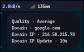

> [!IMPORTANT]
> I'm new to Zig, so it might take me some time to add or update modules. Your help and support mean a lot as I learn and grow with this project! 🥰

# zig-waybar-contrib

**A collection of high-performance Waybar modules written in Zig.**

## 🚀 Overview

`zig-waybar-contrib` offers lightweight, efficient Waybar modules built with [Zig](https://ziglang.org/). By leveraging Zig’s speed and safety, these modules aim to deliver accurate system monitoring with minimal overhead.

## ✨ Features

- ⚡ **High Performance** – Optimized using Zig’s `ReleaseFast` + LTO.
- 🧩 **Modular** – Use only the modules you need.
- 📊 **Real-Time Monitoring** – Reliable and up-to-date metrics.
- 💡 **Minimal Dependencies** – Only essential tools required for specific modules.

## 📦 Available Modules

> All modules output a single-line JSON, fully compatible with Waybar’s `custom` module interface.

| Module  | Description                               | Status           | Dependencies                 | Supported Systems        |
|---------|-------------------------------------------|------------------|------------------------------|--------------------------|
| Updates | Tracks available system updates           | Implemented      | `fakeroot`                   | Arch Linux               |
| GPU     | Monitors GPU statistics and performance   | Implemented      |                              | AMD, Intel and NVIDIA    |
| Memory  | Monitors system memory usage              | Implemented      |                              |                          |
| Ping    | Network latency checker                   | Implemented      |                              |                          |

## 📸 Screenshots

| Module  | Preview                                                                        |
|---------|--------------------------------------------------------------------------------|
| Updates |              |
| GPU     |                                                             |
| Memory  |                                                          |
| Ping    |                                                            |

## 🔧 Installation

### Option 1: Download Release

1. Head to the [GitHub Releases](https://github.com/erffy/zig-waybar-contrib/releases) page.
2. Download the latest compiled binaries.

### Option 2: Build from Source

> **Requirements:** Zig 0.14+

```bash
git clone https://github.com/erffy/zig-waybar-contrib
cd zig-waybar-contrib
zig build
```

## ⚙️ Configuration

Add module entries to your Waybar config (`~/.config/waybar/config`):

```json
{
  "modules-right": [
    "custom/updates", // targets 2
    "custom/gpu", // targets 5
    "custom/memory", // targets 4
    "custom/ping" // no signal implementation
  ],
  "custom/updates": {
    "exec": "path/to/updates-module",
    "return-type": "json",
    "interval": 0,
    "escape": true,
    "signal": 2
  }
  // Add similar blocks for other modules
}
```

## 🤝 Contributing

All contributions are welcome! You can help by:

- Adding new modules
- Improving current implementations
- Fixing bugs
- Enhancing documentation

Feel free to open a PR or an issue 😊

## 🛡️ License

Licensed under the **GNU General Public License v3.0**. See the [LICENSE](./LICENSE) file for more info.

---

### ✨ Made with ❤️ by Me
