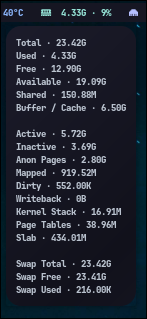

> [!IMPORTANT]  
> This project is in active development. As I'm learning Zig, updates may take time. Your contributions, feedback, and patience are greatly appreciated! 🚀


# zig-waybar-contrib

**High-performance Waybar modules written in Zig for efficient system monitoring**

[](https://gnu.org/licenses/gpl-3.0)
[](https://ziglang.org/)
[](https://github.com/Alexays/Waybar)

## Overview

`zig-waybar-contrib` is a collection of lightweight, blazingly fast Waybar modules built with Zig. These modules are designed to provide accurate system monitoring with minimal resource usage, taking advantage of Zig's performance characteristics and memory safety.

## Why Zig?

- **Zero-cost abstractions** - Runtime performance without sacrificing code clarity
- **Compile-time safety** - Catch errors before they reach production
- **Small binaries** - Minimal overhead for system monitoring
- **Fast compilation** - Quick iteration during development

## Features

- ⚡ **Ultra-fast execution** - Optimized with `ReleaseFast` + LTO + LLVM
- 🔒 **Memory safe** - No buffer overflows or memory leaks
- 🧩 **Modular design** - Include only what you need
- 📊 **Real-time data** - Accurate, up-to-date system metrics
- 🎯 **Waybar native** - JSON output format, seamless integration
- 🪶 **Lightweight** - Minimal system dependencies

## Available Modules

All modules output single-line JSON compatible with Waybar's `custom` module interface.

| Module      | Description                    | Status       | Dependencies | Platforms     | Signal  |
|-------------|--------------------------------|--------------|--------------|---------------|---------|
| **Updates** | System package update tracker  | ✅ Ready     | `fakeroot`   | Arch Linux    | 2       |
| **GPU**     | GPU usage, temperature, memory | ✅ Ready     | None         | AMD RX Series | 5       |
| **Memory**  | RAM usage and statistics       | ✅ Ready     | None         | Linux         | 4       |
| **Ping**    | Network latency monitoring     | ✅ Ready     | None         | Linux         | None    |
| **Network** | Network speed monitoring       | ⚠️ Partially |              | Linux         | 3       |

<!--
### Planned Modules

- [ ] **CPU** - Processor usage and frequency monitoring  
- [ ] **Disk** - Storage usage and I/O statistics
- [ ] **Network** - Bandwidth and connection monitoring
- [ ] **Battery** - Power status for laptops
- [ ] **Temperature** - System thermal monitoring
-->

## Screenshots

### Updates


### GPU


### Memory


### Ping


## Installation

### Quick Install (Recommended)
- Note: This project will be packaged for Pacman and submitted to the AUR in a future releases.

Download pre-compiled binaries from [GitHub Releases](https://github.com/erffy/zig-waybar-contrib/releases):

<!--
```bash
# Download and extract latest release
curl -L https://github.com/erffy/zig-waybar-contrib/releases/latest/download/zig-waybar-contrib.tar.gz | tar xz
sudo cp zig-waybar-contrib/* /usr/local/bin/
```
-->

### Build from Source

**Requirements:**
- Zig: 0.14.0+
- Git

```bash
# Clone the repository
git clone https://github.com/erffy/zig-waybar-contrib.git && cd zig-waybar-contrib

# Build all modules
zig build

# Install to system
sudo cp zig-out/bin/* /usr/local/bin/
```

<!--
### Arch Linux (AUR)

```bash
# Using your favorite AUR helper
paru -S zig-waybar-contrib-git
# or
yay -S zig-waybar-contrib-git
```
-->

## Configuration

### Basic Waybar Setup

Add to your Waybar configuration (`~/.config/waybar/config.jsonc`):

```jsonc
{
  "modules-right": [
    "custom/updates",
    "custom/gpu", 
    "custom/memory",
    "custom/ping",
    "custom/network"
  ],
  
  "custom/updates": {
    "exec": "/usr/local/bin/updates-module",
    "return-type": "json",
    "interval": 0,
    "signal": 2,
    "escape": true
  },
  
  "custom/gpu": {
    "exec": "/usr/local/bin/gpu-module",
    "return-type": "json", 
    "interval": 0,
    "signal": 5,
  },
  
  "custom/memory": {
    "exec": "/usr/local/bin/memory-module",
    "return-type": "json",
    "interval": 0,
    "signal": 4, 
  },
  
  "custom/ping": {
    "exec": "/usr/local/bin/ping-module",
    "return-type": "json",
    "interval": 1
  },

  // ⚠️ Partially implemented, unexpected behavior may occur.
  "custom/network": {
    "exec": "/usr/local/bin/network-module",
    "return-type": "json",
    "interval": 0,
    "signal": 3
  }
}
```

<!--

PLANNED FEATURE

### Advanced Configuration

#### Module-specific Settings

Each module accepts environment variables for customization:

```bash
# Ping module settings
export PING_HOST=8.8.8.8   # Target host
export PING_WARN_MS=50     # Warning latency
export PING_CRIT_MS=200    # Critical latency
```
--->

## Development

### Project Structure

```
zig-waybar-contrib/
├── src/
│   ├── updates.zig    # Updates module
│   ├── gpu.zig        # GPU module  
│   ├── memory.zig     # Memory module
│   ├── network.zig    # Network module
│   └── ping.zig       # Ping module
├── build.zig          # Build configuration
└── assets/            # Screenshots
```

<!--
## Troubleshooting

### Common Issues

**Module not updating:**
```bash
# Check if module runs standalone
/usr/local/bin/gpu-module

# Verify Waybar can execute it
waybar -l debug
```

**Permission errors:**
```bash
# Ensure modules are executable
chmod +x /usr/local/bin/*-module
```

**GPU module shows no data (AMD):**
```bash
# Check GPU files exist
ls /sys/class/drm/card*/device/
```
-->

## Contributing

Contributions are welcome! Here's how you can help:

### Code Contributions
- 🐛 **Bug Fixes** - Help squash issues
- ⚡ **Performance Improvements** - Make modules even faster  
- 🧩 **New Modules** - Add support for more system metrics
- 🎨 **Code Quality** - Improve readability and maintainability

### Other Ways to Help
- 📖 **Documentation** - Improve guides and examples
- 🧪 **Testing** - Report bugs and compatibility issues
- 💡 **Feature Requests** - Suggest new modules or improvements
- 🎨 **Themes** - Share your Waybar styling configs

### Development Workflow

1. Fork the repository
2. Create a feature branch: `git checkout -b feature/amazing-module`
3. Make your changes and test thoroughly
4. Follow Zig style conventions: `zig fmt src/`
5. Add tests if applicable
6. Submit a pull request with a clear description

## Roadmap

- [ ] Implement Environment-based configuration
- [ ] Implement Network speed monitoring

## License

This project is licensed under the **GNU General Public License v3.0**. See [LICENSE](./LICENSE) for details.

## Acknowledgments

- **Zig Team** - For creating an amazing systems programming language
- **Waybar Contributors** - For the excellent status bar that makes this possible  
- **Community** - For feedback, bug reports, and contributions

---

<div align="center">

**Made with ❤️ by Me**

*Star ⭐ this repo if you find it useful!*

</div>